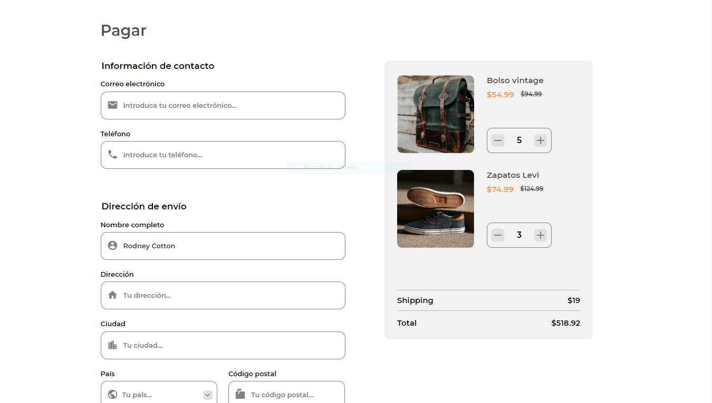
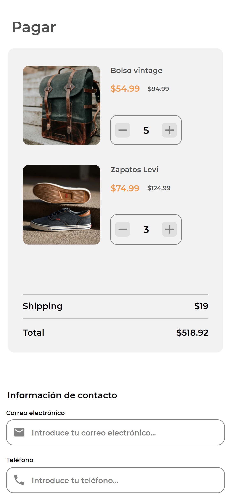
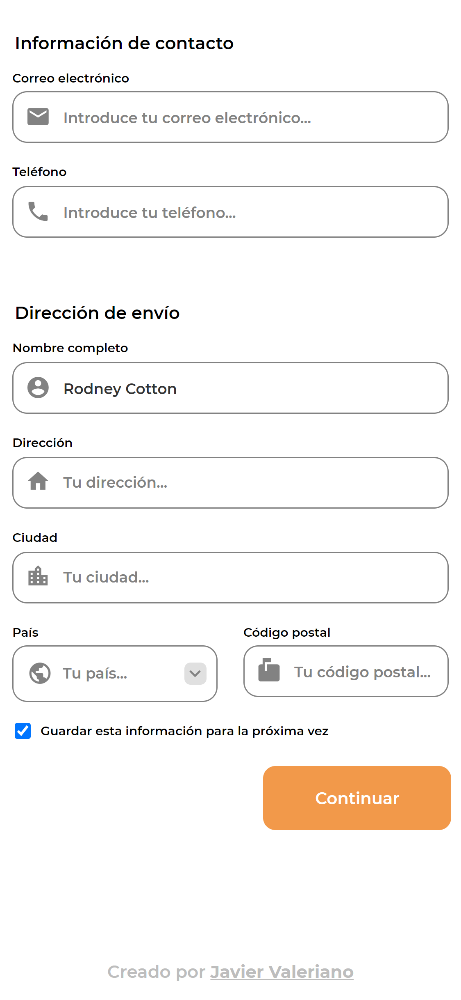

<!-- Please update value in the {}  -->

<h1 align="center">Checkout page | Página de pago</h1>

   Solution for a challenge from  <a href="http://devchallenges.io" target="_blank">Devchallenges.io</a>. | Solución para un desafío de <a href="http://devchallenges.io" target="_blank">Devchallenges.io</a>.

  <h3>
    <a href="https://javiervaleriano.github.io/devchallenge-checkout-page/">
      Demo
    </a>
     | 
    <a href="https://{your-url-to-the-solution}">
      Solution / Solución
    </a>
     | 
    <a href="https://devchallenges.io/challenges/0J1NxxGhOUYVqihwegfO">
      Challenge / Desafío
    </a>
  </h3>

<!-- TABLE OF CONTENTS -->

## Table of Contents | Tabla de contenido

- [Overview | Visión general](#overview--visi%C3%B3n-general)
  - [Built With | Construido con](#built-with--construido-con)
- [Features | Características](#features--caracter%C3%ADsticas)
- [Acknowledgements | Agradecimientos](#acknowledgements--agradecimientos)
- [Contact | Contacto](#contact--contacto)

<!-- OVERVIEW -->

## Overview | Visión general

### Desktop | Escritorio

.png)

### Mobile | Móvil

Hello everyone, I hope you are well. This is my [solution]() to [challenge](https://devchallenges.io/challenges/0J1NxxGhOUYVqihwegfO) from Devchallenges.io |
Hola a todos, espero que estén bien. Esta es mi [solución]() al [desafío](https://devchallenges.io/challenges/0J1NxxGhOUYVqihwegfO) de Devchallenges.io

Here you can see my [demo](https://javiervaleriano.github.io/devchallenge-checkout-page/). | Aquí pueden ver mi [demo](https://javiervaleriano.github.io/devchallenge-checkout-page/).

In this project, despite not being 100% necessary to use JavaScript, I took the liberty of using it to add some features such as changing the total price of the purchase by changing the number of items to buy, the use of the Sweet Alert 2 library to generate the successful validation alert, modify to my liking the behavior of the form and some other elements of the interface. In addition, it allowed me to learn HTML elements and attributes that I didn't know before and my first time using modular JavaScript to have a little more organized code.

As in all my projects, I add a URL (all related to my developer profile, of course) randomly to the footer link and repeat the process constantly every 5 seconds. |
En este proyecto, a pesar de no ser necesario al 100% usar JavaScript, me tomé la libertad de usarlo para agregar algunas características como el cambio del precio total de la compra al cambiar la cantidad de elementos a comprar, el uso de la librería Sweet Alert 2 para generar la alerta de validación exitosa, modificar a mi gusto el comportamiento del formulario y de algunos otros elementos de la interfaz. Además, me permitió conocer elementos y atributos HTML que desconocía anteriormente y mi primera vez usando JavaScript modular para tener un código uun poco más organizado.

Como en todos mis proyectos, agrego una URL (todas relacionadas con mi perfil de desarrollador, por supuesto) de forma aleatoria al enlace del footer y repito el proceso constantemente cada 5 segundos.

### Built With | Construido con

<!-- This section should list any major frameworks that you built your project using. Here are a few examples.-->

- [HTML](https://developer.mozilla.org/es/docs/Learn/HTML/Introduction_to_HTML)
- [CSS](https://developer.mozilla.org/es/docs/Learn/CSS)
- [JavaScript](https://developer.mozilla.org/es/docs/Web/JavaScript)

## Features | Características

<!-- List the features of your application or follow the template. Don't share the figma file here :) -->

This application/site was created as a submission to a [DevChallenges](https://devchallenges.io/challenges) challenge. The [challenge](https://devchallenges.io/challenges/0J1NxxGhOUYVqihwegfO) was to build an application to complete the given user stories: | Esta aplicación/sitio se creó como una entrega a un desafío de [Devchallenges](https://devchallenges.io/challenges). El [desafío](https://devchallenges.io/challenges/0J1NxxGhOUYVqihwegfO) fue crear una aplicación para completar las historias de usuario dadas:

- User story: I can see a page following the given design. | Puedo ver una página siguiendo el diseño dado.

- User story: I can input email, phone, full name, address, city, country, and postal code. | Puedo introducir el correo electrónico, el teléfono, el nombre completo, la dirección, la ciudad, el país y el código postal.

- User story: I can input the number of items. | Puedo introducir el número de artículos.

- User story: I can select at least 3 countries from the dropdown. | Puedo seleccionar al menos 3 países del menú desplegable.

- User story: When I click submit button or press enter, I can see a warning if validation fails. | Cuando hago clic en el botón de envío o pulso enter, puedo ver una advertencia si la validación falla.

- User story: When I click submit button or press enter, I can see a successful alert if validation succeeds. | Cuando hago clic en el botón de envío o pulso enter, puedo ver una alerta de éxito si la validación se realiza correctamente.

## Acknowledgements | Agradecimientos

<!-- This section should list any articles or add-ons/plugins that helps you to complete the project. This is optional but it will help you in the future. For example -->

- [ELEMENTO INPUT (TYPE=TEL)](https://www.htmlquick.com/es/reference/tags/input-tel.html)
- [Cómo estructurar un formulario HTML](https://developer.mozilla.org/es/docs/Learn/Forms/How_to_structure_a_web_form)
- [Como agregar un icono en un html select options](https://www.mariouriarte.com/2020/04/como-agregar-un-icono-en-un-html-select-options/)
- [SweetAlert2](https://sweetalert2.github.io/)
- [Validación de formularios de datos](https://developer.mozilla.org/es/docs/Learn/Forms/Form_validation)
- [Selectores CSS avanzados](https://lenguajecss.com/css/selectores/selectores-avanzados/)
- [Object.freeze()](https://developer.mozilla.org/es/docs/Web/JavaScript/Reference/Global_Objects/Object/freeze)
- [Object.isFrozen()](https://developer.mozilla.org/es/docs/Web/JavaScript/Reference/Global_Objects/Object/isFrozen)
- (Sobre cómo usar px, em, rem y % en "Responsive Design")[https://abalozz.es/sobre-como-usar-px-em-rem-y-percent-en-responsive-design/]
- (Tachado con CSS)[https://desarrolloweb.com/faq/tachado-css]
- (¿Cómo dar estilo al Input type number?)[https://www.creatuwebnicaragua.com/como-dar-estilo-al-input-type-number/]
- (pointer-events)[https://developer.mozilla.org/en-US/docs/Web/CSS/pointer-events]
- (cursor)[https://developer.mozilla.org/es/docs/Web/CSS/cursor]
- (HTMLElement.focus())[https://developer.mozilla.org/en-US/docs/Web/API/HTMLElement/focus]
- (::placeholder)[https://developer.mozilla.org/es/docs/Web/CSS/::placeholder]
- (Personalizar un Select con CSS)[https://www.antofernandez.com/personalizar-un-select-con-css/#logo]

## Contact | Contacto

- [Devchallenges profile | Perfil de Devchallenges](https://devchallenges.io/portfolio/javiervaleriano)
- Codepen: [@javiervaleriano](https://codepen.io/javiervaleriano)
- GitHub: [@javiervaleriano](https://github.com/javiervaleriano)
- Instagram: [@javiervalerianoz](https://www.instagram.com/javiervalerianoz/)
- Twitter: [@javaleriano2](https://twitter.com/javaleriano2)
